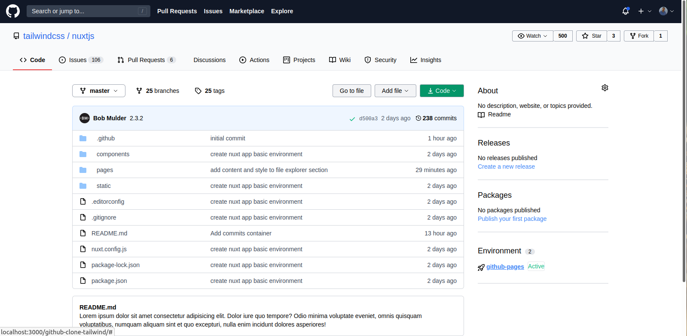

# github-clone-tailwind

This project demonstrates Tailwind and HTML skills by cloning GitHub page, achieved by applying industry best practices and utilizing latest technologies.

## Screenshot

## Built With

- NuxtJS
- Laravel
- Tailwind
- Visual Studio Code
- Git and GitHub

## Getting Started

To use this application on your local machine, please follow the below steps:
- `git clone https://github.com/Rayan84/github-clone-tailwind.git`
- `npm install`
- `npm run dev` to start the server
- On your browser go to `localhost:3000`

## Author

👤 **Rayan Rassam**
- Github:[@Rayan84](https://github.com/Rayan84)
- Twitter:[@Rayan65096267](https://twitter.com/Rayan65096267)
- LinkedIn:[@rayan rassam](https://www.linkedin.com/in/rayan-rassam-18a0a426/)

## 🤝 Contributing

Contributions, issues, and feature requests are welcome!

## Show your support

Give a ⭐️ if you like this project!

## Acknowledgement

Special thanks to...

## 📝 License

Copyright 2021 Rayan Rassam
